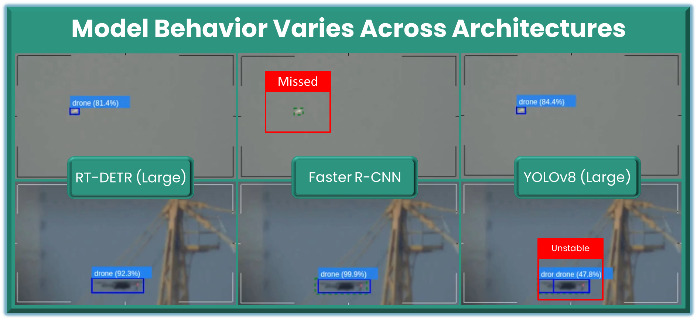
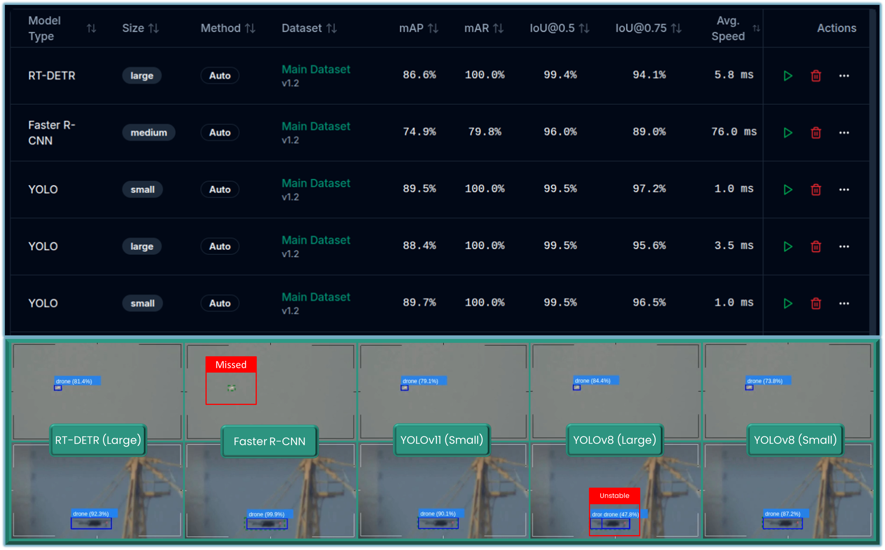

# EO Drone Detection Benchmark

A standardized evaluation of object detection architectures on EO (electro-optical) drone imagery under real-world conditions.

---

  

---

## Overview

This benchmark evaluates how modern object detection models behave when applied to long-range EO drone detection.

The focus extends beyond aggregate performance metrics to include **model behavior under operational conditions**, including:

- detection at long range and small object scale  
- sensitivity to background clutter  
- localization stability  
- emergence of failure modes  

All models are evaluated under aligned training and validation conditions to ensure comparability.

---

## Scope

This repository provides **evaluation results only**.

Model weights and deployment artifacts are not distributed.

The purpose of this benchmark is to:

- provide a controlled comparison across architectures  
- expose behavior not captured by aggregate metrics  
- document failure modes relevant to real-world deployment  

Deployable models derived from this evaluation are available in the IRIS Model Zoo.

---

## Problem Context

Drone detection in EO imagery introduces challenges not well represented in standard datasets:

- targets occupy very few pixels  
- contrast degrades significantly with distance  
- environmental clutter introduces ambiguity  
- object appearance varies across lighting and perspective  

Under these conditions, differences between architectures become more pronounced, particularly in recall and localization stability.

---

## Models Evaluated

The following architectures were evaluated:

- YOLOv8 (Small, Large)  
- YOLOv11 (Small)  
- RT-DETR (Large)  
- Faster R-CNN (ResNet50 FPN v2)  

All models were trained and evaluated using a consistent dataset split and aligned preprocessing pipeline.

---

## Observed Behavior

Model behavior varied consistently across architectures under identical conditions.

Several patterns emerged during evaluation:

- significant differences in recall at long range  
- variation in localization stability across architectures  
- architecture-specific failure modes  
- inconsistency between confidence scores and detection reliability  

  

Across multiple validation samples:

- some models maintained detection at long range while others failed entirely  
- certain architectures exhibited duplicate detections under clutter  
- localization quality varied even when detections were present  

One architecture demonstrated a consistent failure mode at distance, missing all long-range instances despite strong performance under closer conditions.

These behaviors were consistent and repeatable, not isolated cases.

---

## Key Takeaways

- model performance is highly dependent on operating conditions  
- failure modes are architecture-dependent  
- aggregate metrics do not fully capture real-world behavior  

Detailed observations and model-specific analysis are provided in:

→ `results/notes.md`

---

## Interpretation

Aggregate metrics such as mAP and mAR summarize overall performance, but they do not fully capture how models behave under real-world conditions.

In this benchmark, consistent differences were observed across architectures:

- recall at long range varied significantly, with some models maintaining detection while others failed entirely  
- failure modes were repeatable and specific to each architecture  
- confidence scores did not reliably reflect detection robustness, particularly under challenging conditions  

These patterns were observed across multiple validation samples and are not attributable to isolated cases.

As a result, **model selection based solely on aggregate metrics is insufficient for deployment decisions**.

Model performance is evaluated using standard detection metrics:

- mAP (mean Average Precision)  
- mAR (mean Average Recall)  
- IoU (Intersection over Union)  
- precision and recall  

In addition to aggregate metrics, behavior-aware measures are included to capture performance under real-world conditions:

- small object recall  
- miss rate  
- duplicate detection rate  

These metrics are complemented by qualitative inspection of model outputs to assess:

- detection consistency  
- localization stability  
- behavior under distance and clutter  

Full results:
→ `results/iris-benchmark-drone-eo-metrics.csv`

## Dataset

The evaluation uses EO drone imagery derived from real-world video data.

A subset of **23 sequences** was selected from the Anti-UAV dataset:
→ https://anti-uav.github.io/dataset/

Frames were extracted and curated to capture variation in:

- object distance and scale  
- visual representation of the target  
- background complexity and clutter  

The resulting dataset contains **1,000 validated annotations** for a single class:

- drone  

The dataset is intentionally constructed to emphasize long-range detection and small object scenarios.

---

## Methodology

All models were evaluated under aligned conditions to ensure comparability.

- a consistent dataset split was used across all models  
- preprocessing and augmentation were applied uniformly  
- evaluation was performed on a shared validation set  

Both quantitative metrics and qualitative inspection were used to assess performance.

The evaluation protocol is designed so observed differences reflect **model behavior**, not experimental variation.

All conclusions are based on repeated observations across validation samples.

---

## Positioning Within IRIS

- Benchmark → structured comparison of model behavior  
- Experiments → analysis of behavior across conditions  
- Model Zoo → deployment of validated models  

---

  <strong>IRIS is built for lifecycle-driven computer vision.</strong>

